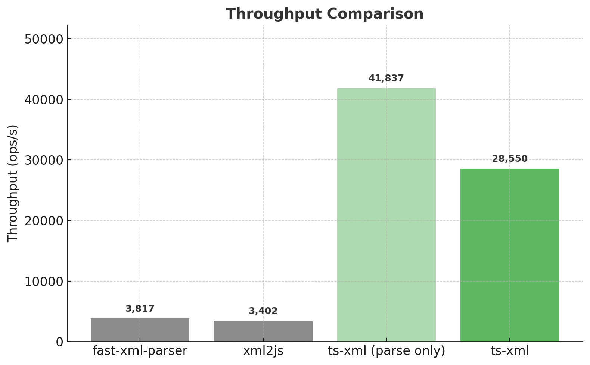

# ts-xml

A high-performance, schema-based XML parser for TypeScript with strong type safety.

## Features

- 🚀 **High Performance** - Significantly faster than popular alternatives
- 🔒 **Type Safety** - Full TypeScript support with schema-based validation
- 📝 **Schema Definition** - Define your XML structure with a simple, declarative API
- ✅ **Validation** - Automatic validation with detailed error messages
- 🎯 **Zero Dependencies** - Lightweight with no external dependencies

## Installation

```bash
npm install ts-xml
```

## Quick Start
```typescript
import * as tx from "ts-xml";

// Define your schema
const bookSchema = tx.object({
    id: tx.string("id", "attribute"), 
    title: tx.string("title", "element"), 
    author: tx.string("author", "element"), 
    price: tx.number("price", "element"),
});

// Parse XML with type safety
const xml = `
  <book id="bk001">
    <title>The Great Gatsby</title>
    <author>F. Scott Fitzgerald</author>
    <price>10.99</price>
  </book>
`;

const result = bookSchema.parse(xml);
// result is fully typed!
console.log(result.title); // "The Great Gatsby"
```

## Schema API

### Basic Types

#### `string(name, type, optional?)`
Parse XML element or attribute as a string.

```typescript
// Element: <title>Book Title</title>
tx.string("title", "element")

// Attribute: <book id="123">
tx.string("id", "attribute")
```

#### `number(name, type, optional?)`
Parse XML element or attribute as a number.

```typescript
// Element: <price>19.99</price>
tx.number("price", "element")

// Attribute: <item count="5">
tx.number("count", "attribute")
```

#### `boolean(name, type, optional?)`
Parse XML element or attribute as a boolean.

```typescript
// Element: <available>true</available>
tx.boolean("available", "element")

// Attribute: <item inStock="false">
tx.boolean("inStock", "attribute")
```

### Complex Types

#### `object(name?, schema, optional?)`
Parse XML element with nested structure.

```typescript
const personSchema = tx.object({
    name: tx.string("name", "element"), 
    age: tx.number("age", "element"), 
    email: tx.string("email", "element"),
});

// Parses:
// <person>
//   <name>John Doe</name>
//   <age>30</age>
//   <email>john@example.com</email>
// </person>
```

#### `array(name?, schema, optional?)`
Parse multiple XML elements as an array.

```typescript
// Array with element name
const genresSchema = tx.array("genre", tx.string());
// Parses: <genres><genre>Fiction</genre><genre>Drama</genre></genres>

// Array without element name (for root elements)
const booksSchema = tx.array(
    tx.object({
        title: tx.string("title", "element"),
    })
);
// Parses: <books><book><title>The Great Gatsby</title></books>
```

## Benchmarks



The chart compares the throughput (operations per second) of three XML parsers.
fast-xml-parser achieves 7,060 ops/s, and xml2js follows closely with 6,681 ops/s.
In contrast, ts-xml reaches 40,716 ops/s, which is about **5.8× faster than fast-xml-parser and 6.1× faster than xml2js**.
This clearly shows that ts-xml delivers far superior performance, providing high-speed XML parsing suitable for demanding real-time or large-scale applications.

## API Reference

### Exports

- `ts-xml` - Main schema API
- `ts-xml/parser` - Low-level XML parser
- `ts-xml/schema` - Schema types and utilities
- `ts-xml/util` - Utility functions

## Contributing

Contributions are welcome! Please feel free to submit a Pull Request.
